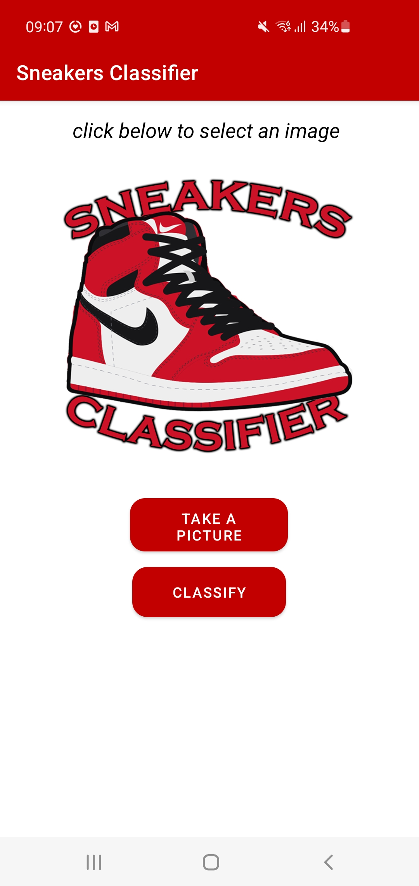

# Sneakers Classifiers

<h2>Digital System M Project</h2>

Developed with <a href="https://github.com/Pirs98">Santandrea Pietro</a>

Android app which uses a deep neural network to quickly learn what model of sneakers people wears.

# Abstract

App GUI is straightforward and allow to load a sneakers picture from a directory or directly from the camera thanks to <a href="https://developer.android.com/training/camerax">cameraX</a> functionalities.
The prediction of the sneakers is made as soon as the image has been loaded to avoid the user to wait when he clicks on the classify button. Then this button print the result of the computazion below the image and gives a direct web link to buy the found model.

# Build the dataset
Strangely the web misses a detaset about sneakers so we decided to build an early embryonic version.
We generated the dataset using <a href="https://download-all-images.mobilefirst.me">this</a> chrome extension which download all the images in the current webpage. Then for all the sneakers model we wanted to classify we looked for images in many sites such as restocks, stockx and goat. Also we perform several researches on google images such as: 
<ul>
    <li>Air Jordan 1 High;</li>
    <li>Air Jordan 1 High for sale;</li>
    <li>Air Jordan 1 High on feet;</li>
    <li>Air Jordan 1 High outfit.</li>
</ul>
Finally we performed a manual screener to delete all the unwanted images (and yes it took a while).
We end up with 8 classes and around 600 images for each of them.

# Train the model
We first tried multiple neural newtworks both made by us or leveraging the existing one and finally took advantage of transfer learning and get great results by utilizing a MobileNet architecture. With a little fine tuning and after a few epochs, we are able to achieve greater than 90% accuracy on the validation set.

For more details on the code, check out the Jupyter notebook <a href="build_model/model_creation.ipynb">here</a>.

# Develop the android app
We choose android as our mobile architecture as we are more confidence with java. However deploy the app for iOS shouldn't be that hard. It has been developed with <a href="https://developer.android.com/studio">Android Studio</a>. 
Below some screenshot of our android application.

table {
    border: 1px solid #CCC;
    border-collapse: collapse;
}

td {
    border: none;
}
<table>
    <tr>
        <td></td>
        <td></td>
    </tr>
    <tr>
        <td></td>
        <td></td>
    </tr>
</table>
    
   

